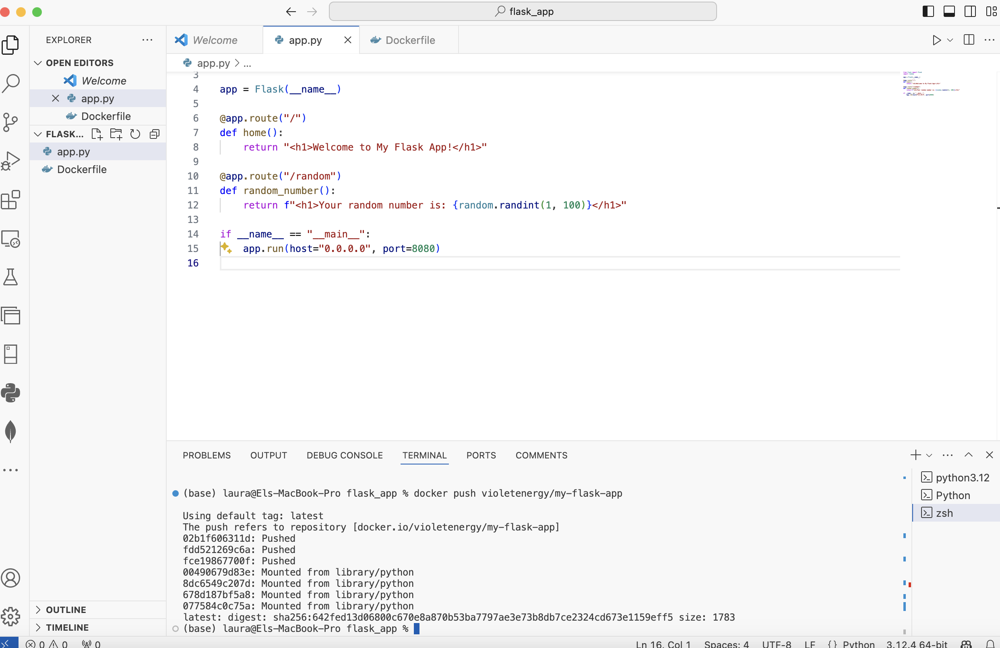
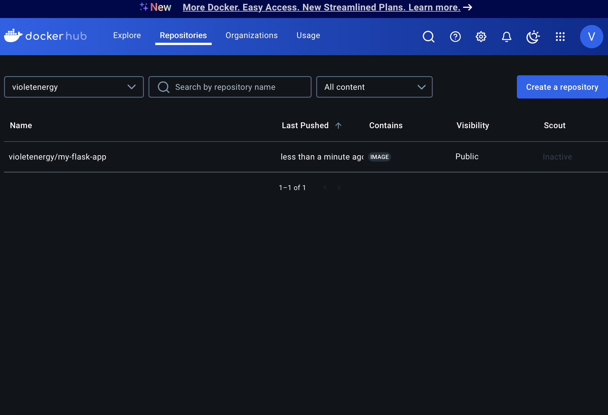
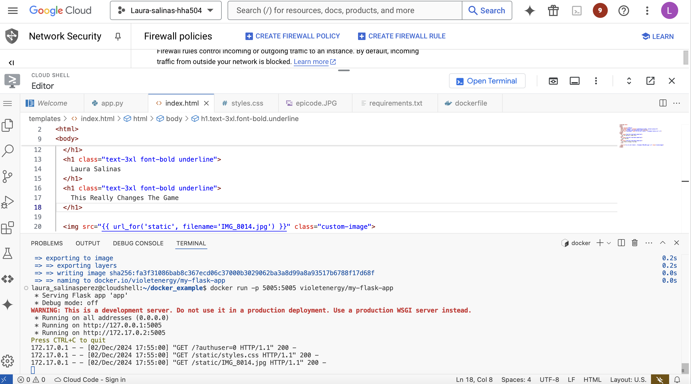
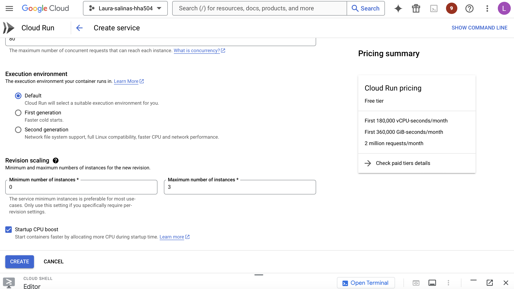
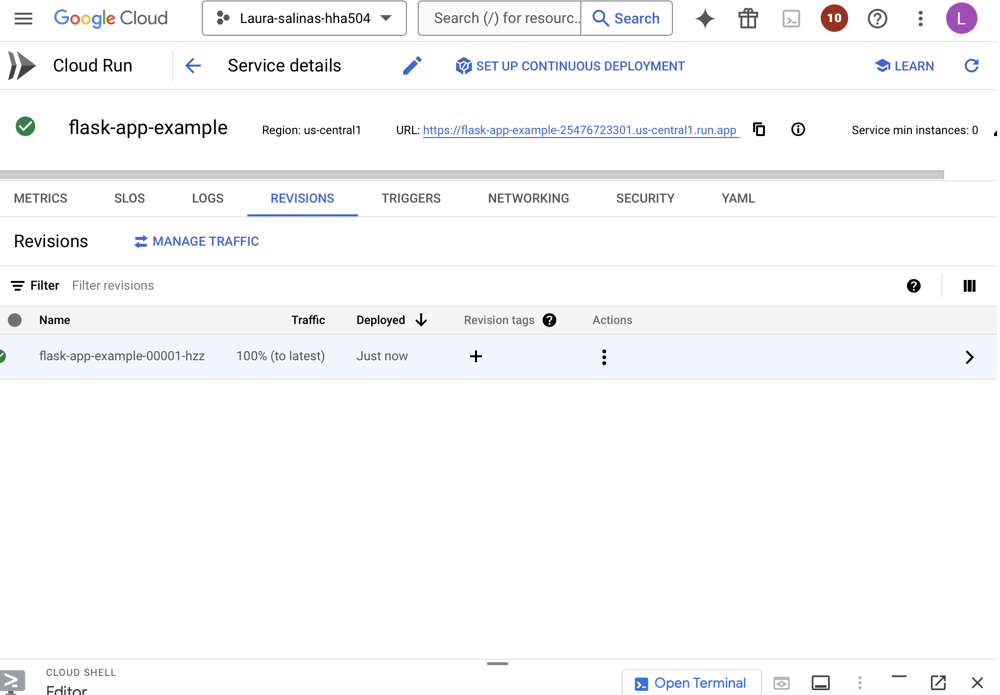

# Deployment to Google Cloud Run

# Steps Taken:
1. Built and pushed the Docker image to Docker Hub.
2. Deployed the image to GCP Cloud Run.
3. Configured scaling and environment variables.

# Docker Hub Repo Creation:

# GCP Cloud Run:

# Reflection:
- The deployment process was straightforward.
- Challenges: Encountered an issue where the Flask app wasn’t listening on the required `PORT=8080`. Fixed this by updating the Flask app configuration, as well as updating to `PORT=5005`.
- Insights: Cloud Run’s autoscaling feature is great for handling traffic spikes.
- Learned the importance of correctly tagging Docker images for deployment.
